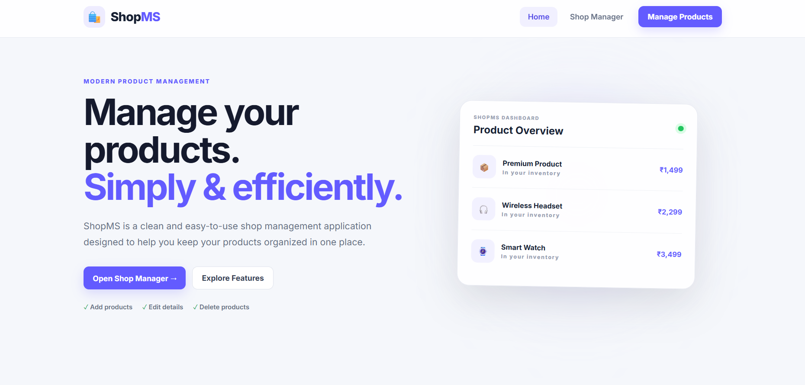
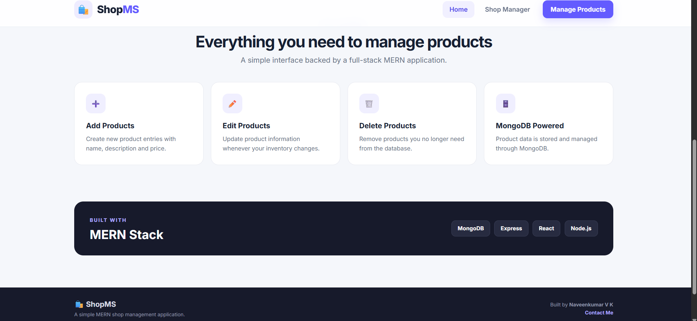
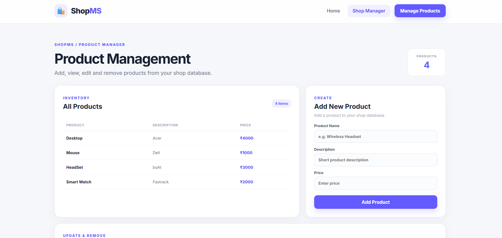
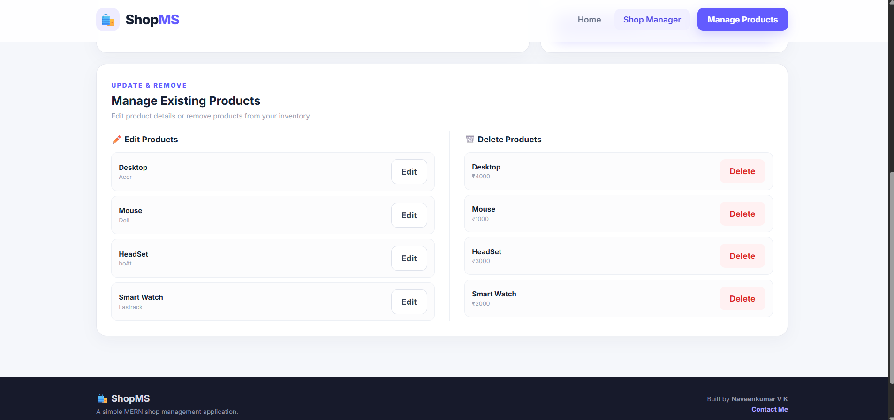

# 🛍️ ShopMS

### Full-Stack MERN Product Management Application

ShopMS is a full-stack product management application built using the **MERN stack**. It provides a clean and responsive interface for managing products with complete **CRUD operations**, backed by a REST API and MongoDB database.

---

## ✨ Features

- 📋 View all products
- ➕ Add new products
- ✏️ Edit existing products
- 🗑️ Delete products
- 🔌 RESTful API
- 🍃 MongoDB database
- ⚛️ React-based frontend
- ⚡ Vite development environment
- 📱 Responsive and modern user interface

---

## 📸 Screenshots

### 🏠 Home Page



### 📦 Product Dashboard



### ➕ Add Product



### ✏️ Edit Product



---

## 🛠️ Tech Stack

### Frontend

- ⚛️ React
- ⚡ Vite
- 🌐 React Router
- 🟨 JavaScript
- 🎨 CSS

### Backend

- 🟢 Node.js
- 🚂 Express.js
- 🔗 REST API

### Database

- 🍃 MongoDB
- 🦫 Mongoose

---

## 📁 Project Structure

```text
ShopMS/
│
├── client/
│   ├── public/
│   └── src/
│       ├── pages/
│       │   ├── Home.jsx
│       │   └── About.jsx
│       ├── AddProduct.jsx
│       ├── EditProduct.jsx
│       ├── DeleteProduct.jsx
│       ├── Productlist.jsx
│       ├── Footer.jsx
│       ├── App.jsx
│       └── main.jsx
│
├── server/
│   ├── db.js
│   ├── products.js
│   ├── server.js
│   └── public/
│
├── screenshots/
│
├── .gitignore
└── README.md
```

---

## ⚙️ Getting Started

### Prerequisites

Make sure you have the following installed:

- **Node.js**
- **npm**
- **MongoDB**

### 1. Clone the repository

```bash
git clone https://github.com/Navee403/ShopMS.git
cd ShopMS
```

### 2. Start MongoDB

Make sure your local MongoDB server is running.

### 3. Start the Backend

Open a terminal:

```bash
cd server
npm install
npm start
```

The backend runs on:

```text
http://localhost:3000
```

### 4. Start the Frontend

Open another terminal:

```bash
cd client
npm install
npm run dev
```

The frontend runs on:

```text
http://localhost:5173
```

---

## 🔌 API Endpoints

| Method | Endpoint | Description |
|---|---|---|
| GET | `/products` | Get all products |
| POST | `/products` | Add a product |
| PUT | `/products/:id` | Update a product |
| DELETE | `/products/:id` | Delete a product |

---

## 🎯 Project Highlights

ShopMS demonstrates practical full-stack development by combining:

- React component-based UI development
- REST API development with Express.js
- MongoDB database integration
- Mongoose data modeling
- Complete CRUD operations
- Frontend and backend integration
- Responsive interface design

---

## 👨‍💻 Author

### Naveen Kumar

**Full Stack Developer | MERN Stack | Java Full Stack**

GitHub: [Navee403](https://github.com/Navee403)

---

⭐ If you find this project useful, consider giving it a star!
